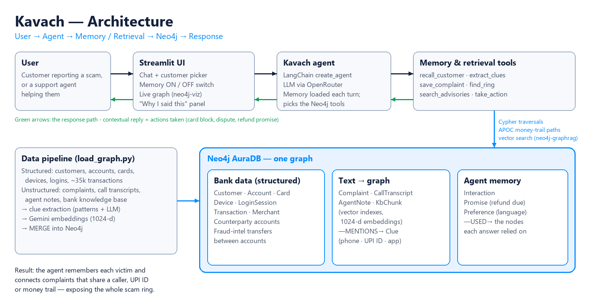

# Kavach — a bank support agent that remembers victims and uncovers scam rings

Neo4j × hackFront India Agent Memory Build Sprint, Pune (26 Sep 2026) · Problem Statement 1: Context-Aware Customer Support Agent.

## Problem
Victims of UPI scams (fake KYC calls, electricity-bill SMS, fake refund helplines, "task" job offers) have to repeat their story to every support agent, and the bank handles each complaint on its own. So the same caller number and the same receiving accounts keep working.

## Target user
Bank customer-support and fraud-desk teams, and the customers they serve.

## Solution
Kavach is a support agent with memory. When a customer reports a scam, it:
1. recalls the customer's history (past complaints, actions taken, promises, preferred language);
2. extracts clues from the free text (caller number, UPI ID, app used) and stores the complaint in the graph;
3. finds other complaints that share those clues and follows the money across receiving accounts;
4. replies with the right actions (card block, dispute, refund timeline) and records what it promised.

The agent is built with **LangChain** (`create_agent`, tool calling) on an LLM served through OpenRouter. Each turn, the customer's memory is loaded from Neo4j into the prompt, and the agent chooses which Neo4j tools to call. All writes go through fixed, parameterised Cypher in a single transaction, so the LLM never writes Cypher itself.

## What the agent remembers
- Complaints, call transcripts and staff notes, with their status
- Actions taken and promises made (dispute ids, refund due dates)
- Preferences such as reply language
- Every interaction, linked to the graph nodes it used

## How Neo4j is used
- **One AuraDB graph** holds structured bank data, unstructured text turned into graph, and agent memory.
- **Clue nodes** (phone number, UPI ID, app, Telegram handle) connect complaints that never mention each other.
- **Native vector indexes** (1024-d Gemini embeddings) with **neo4j-graphrag** retrievers search complaints and the knowledge base.
- **Path queries** (Cypher variable-length paths + APOC) follow money from the customer's account through receiving accounts to the cash-out.
- **neo4j-viz** renders the live subgraph in the app.

## How memory improves support
Without memory the agent says "please visit your branch". With memory it says: your case matches other complaints with the same caller and the same receiving account; your card is blocked, a dispute is raised, and the refund decision is due on a specific date — in the customer's language, without asking them to repeat anything.

## Architecture


More views: [detailed technical architecture](docs/architecture-technical.png) · [all five architecture slides](docs/prototypes/) (flow, layers, Anita's journey, Neo4j hub, graph thinking).

## 3-minute demo
1. **Problem** (0:00–0:30).
2. **Teach** (0:30–1:30): Anita reports the scam; her clues and complaint appear in the graph.
3. **Memory in action** (1:30–2:30): a new conversation ("Any update?") — Kavach recalls her case; switch Memory OFF to compare.
4. **Neo4j** (2:30–3:00): the connected complaints and the money trail in the graph.

## Data
All synthetic and fictional: Sahyadri Bank does not exist, and every phone number uses the invalid `+91 5XXXX XXXXX` range.
- `data/structured/` — customers, accounts, cards, devices, login sessions, merchants, counterparties, transactions, fraud-intel feed (see its README).
- `data/unstructured/` — complaints, call transcripts and agent notes (JSONL, in English, Hinglish, Hindi and Marathi) and the bank knowledge base (`kb/*.md`).
- `data/_spec/` — the scenario generator and answer key used to build the data; the app never reads it.

## Run
```bash
python -m venv .venv
.venv/Scripts/python.exe -m pip install -r requirements.txt
.venv/Scripts/python.exe load_graph.py
.venv/Scripts/python.exe -m streamlit run app.py
```
Credentials are read from the `.env` file one folder up (`NEO4J_*`, `OPENROUTER_*`, `EMBEDDING_*`).
